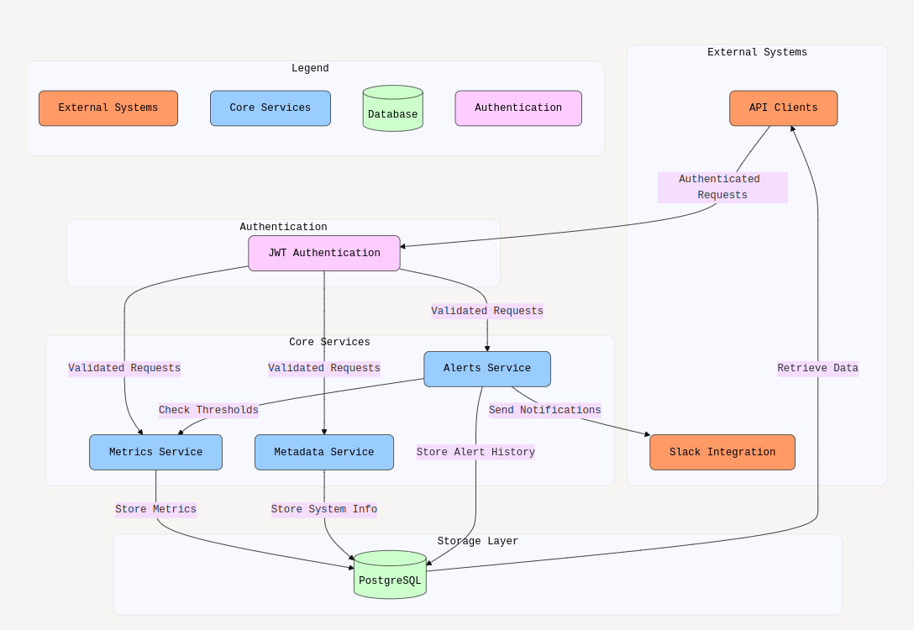
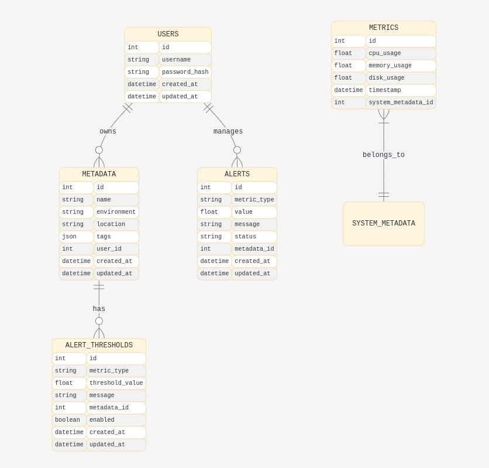

# 🖥️ System Health Monitoring Tool

A comprehensive local system health monitoring solution that provides real-time metrics tracking, alert management, and a secure API interface for system administrators and DevOps teams.


## 📊 Features

- **Real-time Monitoring:** Track CPU, memory, and disk usage metrics
- **Metadata Management:** Assign custom identification to monitored systems
- **Smart Alerting:** Configure thresholds with automatic notifications
- **Historical Data:** Store and retrieve past performance metrics
- **Secure Access:** JWT-based authentication for all endpoints
- **API Documentation:** Interactive Swagger UI for testing and integration
- **Slack Integration:** Receive real-time alerts through Slack webhooks

## 🌐 Live Demo

### Access the live API documentation: [https://system-health-monitor-2v3x.onrender.com/api/docs](https://system-health-monitor-2v3x.onrender.com/api/docs)

## 🛠️ Tech Stack

- **Backend:** NestJS with TypeScript
- **Database:** PostgreSQL
- **ORM:** TypeORM
- **Authentication:** Passport.js with JWT
- **API Docs:** Swagger/OpenAPI
- **Scheduling:** NestJS Task Scheduling
- **Notifications:** Slack integration

## 📋 Prerequisites

- Node.js (v21 or higher)
- PostgreSQL database
- npm or yarn package manager
- Git (for cloning the repository)

## 🚀 Installation Guide

### 1. Clone the Repository

```bash
git clone https://github.com/Harsh-Kesharwani/system-health-monitor.git
cd system-health-monitor
```

### 2. Install Dependencies

```bash
npm install
# or with yarn
yarn install
```

### 3. Database Setup

```bash
# Access PostgreSQL
psql -U postgres

# Create the database
CREATE DATABASE system_monitor;

# Exit PostgreSQL
\q
```

### 4. Environment Configuration

Rename `.env.example` to `.env` and update the values based on your requirements:

```env
# Database Configuration
DB_HOST=localhost
DB_PORT=5432
DB_USERNAME=postgres
DB_PASSWORD=your_password
DB_DATABASE=system_monitor
DB_SYNC=true  # Set to false in production

# JWT Authentication
JWT_SECRET=your_strong_secret_key_here_change_in_production

# Server Configuration
PORT=3000
NODE_ENV=development

# Slack Webhook (Optional)
SLACK_WEBHOOK_URL=https://hooks.slack.com/services/your/webhook/url
```

### 5. Start the Application

#### Development Mode
```bash
npm run start:dev
# or with yarn
yarn start:dev
```

#### Production Mode
```bash
npm run build
npm run start:prod
# or with yarn
yarn build
yarn start:prod
```

## 📝 Using the System

### 1. Access Points

- **Main Application:** http://localhost:3000
- **API Documentation:** http://localhost:3000/api/docs

### 2. First Steps

visit: http://localhost:3000/api/docs

1. Register an admin user
2. Login to get your JWT token
3. Configure system metadata
4. Set up alert thresholds
5. Begin monitoring your system

## 🔐 API Reference

### Authentication Endpoints

#### Register a New User

```bash
curl -X POST http://localhost:3000/api/auth/register \
  -H "Content-Type: application/json" \
  -d '{
    "username": "admin",
    "password": "securepassword123"
  }'
```

#### Login to Get JWT Token

```bash
curl -X POST http://localhost:3000/api/auth/login \
  -H "Content-Type: application/json" \
  -d '{
    "username": "admin",
    "password": "securepassword123"
  }'
```

Response:
```json
{
  "access_token": "eyJhbGciOiJIUzI1NiIsInR5cCI6IkpXVCJ9..."
}
```

### System Metrics Endpoints

#### Get Latest Metrics

```bash
curl -X GET http://localhost:3000/api/metrics \
  -H "Authorization: Bearer YOUR_JWT_TOKEN"
```

Response:
```json
{
  "cpuUsage": 24.5,
  "memoryUsage": 62.3,
  "diskUsage": 78.1,
  "timestamp": "2023-05-15T14:32:10.123Z"
}
```

#### Get Historical Metrics

```bash
curl -X GET "http://localhost:3000/api/metrics/history?limit=10" \
  -H "Authorization: Bearer YOUR_JWT_TOKEN"
```

Response:
```json
[
  {
    "id": 42,
    "cpuUsage": 24.5,
    "memoryUsage": 62.3,
    "diskUsage": 78.1,
    "timestamp": "2023-05-15T14:32:10.123Z"
  },
  ...
]
```

### Metadata Management

#### Create System Metadata

```bash
curl -X POST http://localhost:3000/api/metadata \
  -H "Content-Type: application/json" \
  -H "Authorization: Bearer YOUR_JWT_TOKEN" \
  -d '{
    "name": "Web Server",
    "environment": "production",
    "location": "us-east",
    "tags": {
      "role": "web",
      "tier": "frontend"
    }
  }'
```

#### Get All Metadata

```bash
curl -X GET http://localhost:3000/api/metadata \
  -H "Authorization: Bearer YOUR_JWT_TOKEN"
```

#### Update Metadata

```bash
curl -X PATCH http://localhost:3000/api/metadata/1 \
  -H "Content-Type: application/json" \
  -H "Authorization: Bearer YOUR_JWT_TOKEN" \
  -d '{
    "environment": "staging"
  }'
```

#### Delete Metadata

```bash
curl -X DELETE http://localhost:3000/api/metadata/1 \
  -H "Authorization: Bearer YOUR_JWT_TOKEN"
```

### Alerts Configuration

#### Set Alert Threshold

```bash
curl -X POST http://localhost:3000/api/alerts/thresholds \
  -H "Content-Type: application/json" \
  -H "Authorization: Bearer YOUR_JWT_TOKEN" \
  -d '{
    "type": "cpu",
    "threshold": 80,
    "message": "CPU usage is critically high"
  }'
```

#### Get Active Alerts

```bash
curl -X GET "http://localhost:3000/api/alerts?status=active" \
  -H "Authorization: Bearer YOUR_JWT_TOKEN"
```

Response:
```json
[
  {
    "id": 3,
    "type": "cpu",
    "threshold": 80,
    "value": 85.2,
    "status": "active",
    "message": "CPU usage is critically high",
    "createdAt": "2023-05-15T16:40:23.123Z"
  },
  ...
]
```

## 🚦 Alert Types and Thresholds

| Metric Type | Default Threshold | Description              |
|-------------|-------------------|--------------------------|
| cpu         | 80%               | Overall CPU utilization  |
| memory      | 80%               | RAM usage percentage     |
| disk        | 90%               | Disk space usage         |

## 🔄 Monitoring Workflow

1. **Collection:** System metrics are collected every minute
2. **Evaluation:** Metrics are compared against thresholds
3. **Alerting:** Notifications are triggered for breached thresholds
4. **Resolution:** Alerts are automatically resolved when metrics return to normal
5. **Logging:** All events are stored for historical analysis



## 📊 Database Schema



- **metrics:** Stores time-series data of system performance
- **metadata:** Contains system identification information
- **alerts:** Tracks threshold breaches and resolutions
- **users:** Manages API access credentials

## 🔧 Configuration Options

### Alert Sensitivity

Adjust thresholds based on your system's normal operating parameters:

```bash
# Example: Set memory alert threshold to 90%
curl -X POST http://localhost:3000/api/alerts/thresholds \
  -H "Content-Type: application/json" \
  -H "Authorization: Bearer YOUR_JWT_TOKEN" \
  -d '{
    "type": "memory",
    "threshold": 90
  }'
```

### Data Retention

Historical metrics are kept for 30 days by default. This can be configured in the application settings.

## 🌐 Deployment

### Deploy to Render

1. Create a new PostgreSQL database in Render
2. Create a new Web Service on Render
3. Link to your repository
4. Set the build command: `npm install && npm run build`
5. Set the start command: `npm run start:prod`
6. Add all required environment variables, including the Render PostgreSQL connection URL
7. Click 'Create Web Service'

## 📚 Advanced Usage

### Adding Custom Metrics

Extend the monitoring capabilities by modifying the `MetricsService` to include additional system checks:

```typescript
// Example: Add network traffic monitoring
@Cron(CronExpression.EVERY_MINUTE)
async collectAndSaveMetrics() {
  const metrics = this.collectMetrics();
  metrics.networkUsage = this.getNetworkUsage();
  await this.metricRepository.save(metrics);
}
```

### Webhook Integrations

Configure external notifications to services like Slack or Microsoft Teams:

```typescript
// Add to AlertsService
private async sendWebhookNotification(alert: Alert) {
  // Implementation for your specific integration
}
```

## 🛡️ Security Considerations

- **JWT Expiration:** Tokens expire after 24 hours for security
- **Rate Limiting:** API endpoints are protected against brute force attacks
- **Input Validation:** All user inputs are validated to prevent injection attacks
- **Password Security:** User passwords are hashed using bcrypt

## 🧪 Testing

Run the test suite to ensure everything is working correctly:

```bash
# Unit tests
npm run test

# End-to-end tests
npm run test:e2e

# Test coverage
npm run test:cov
```

## 📜 License

This project is licensed under the MIT License - see the [LICENSE](LICENSE) file for details.

## 👥 Contributing

Contributions are welcome! Please feel free to submit a Pull Request.

1. Fork the repository
2. Create your feature branch (`git checkout -b feature/amazing-feature`)
3. Commit your changes (`git commit -m 'Add some amazing feature'`)
4. Push to the branch (`git push origin feature/amazing-feature`)
5. Open a Pull Request

## 📧 Support

For support, email harshkesharwani777@gmail.com or open an issue on the repository.

---

Built with ❤️ using NestJS and TypeScript.


